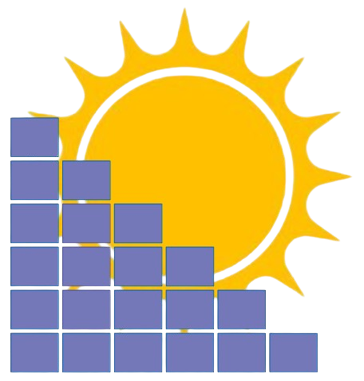

# Solar-Forecast.com for Home Assistant

<p align="center">
  
</p>

Home Assistant custom integration for [Solar-Forecast.com](https://solar-forecast.com) — PV production forecasts, multi-array DC output, and uploaded generation, with a built-in sidebar dashboard.

| | |
|---|---|
| **Domain** | `solar_forecast_com` |
| **Version** | 1.0.0 |
| **IoT class** | Cloud polling |
| **Config** | UI config flow (no YAML required) |
| **API docs** | [solar-forecast.com/api](https://solar-forecast.com/api) |

---

## Features

### Forecasting
- Polls **today + tomorrow + day after** PV forecast from Solar-Forecast.com every **15 minutes**
- Site total AC forecast (`kWatt`), clear-sky expectation, and optional personalised forecast
- **Multi-array** support: per-array DC series (`array_1_kWatt` … `array_N_kWatt`) and metadata from `system_info.arrays`
- Day energy totals (kWh) computed from 15‑minute power samples (× 0.25 h)

### Generation
- Reads cumulative energy uploaded to Solar-Forecast.com (`GET /generation`)
- Converts cumulative kWh → interval power (kW) for charts and sensors
- Negative power from bad/out-of-order meter data is **clamped to 0**

### Home Assistant entities
- Energy and power sensors with proper device classes (kWh / kW)
- One **device** per config entry (plant), with entry-scoped unique IDs
- Dynamic per-array day-energy sensors when the site has multiple arrays

### Sidebar panel
- Custom sidebar item **Solar Forecast** (`mdi:solar-power`)
- Plant selector when multiple config entries are configured
- Layout aligned with the website `/index` dashboard:
  - Summary cards (site + per-array today)
  - Main charts: Forecast / Clear Sky / Generation (and Personalised when present)
  - Array DC output charts
  - Doughnut: today’s array-wise totals
  - Bar: next 3 days total energy
- Responsive layout (stacks on narrow/mobile) with chart resize on window/sidebar changes
- Panel refresh every **5 minutes** (coordinator still polls every 15 minutes)

### Multi-plant
- Add multiple Solar-Forecast.com accounts/API keys as separate config entries
- Each plant has its own name, sensors, and coordinator
- Panel plant dropdown switches between entries

---

## Requirements

- Home Assistant **2024.1+** recommended (uses modern config entries, `StaticPathConfig`, sensor device classes)
- Active [Solar-Forecast.com](https://solar-forecast.com) account with:
  - System setup completed (location, arrays, inverter)
  - An **API key** (from the website after login)
- Network access from Home Assistant to `https://solar-forecast.com`

Dependencies declared by the integration: `http`, `frontend`.

---

## Installation

### Manual install

1. Copy the `solar_forecast_com` folder into your Home Assistant `custom_components` directory:

   ```text
   <config>/custom_components/solar_forecast_com/
   ```

   The folder must contain at least:

   ```text
   solar_forecast_com/
   ├── __init__.py
   ├── manifest.json
   ├── config_flow.py
   ├── const.py
   ├── coordinator.py
   ├── sensor.py
   ├── views.py
   ├── panel.py
   ├── arrays.py
   ├── energy.py
   ├── forecast_days.py
   ├── api.py
   ├── brand/
   │   ├── icon.png
   │   ├── logo.png
   │   └── …
   ├── frontend/
   │   ├── panel.js
   │   └── chart.umd.min.js
   └── ...
   ```

2. Restart Home Assistant.

3. Confirm the integration appears under **Settings → Devices & services → Add integration**.

### Install through HACS
1. Open **HACS**
2. Go to the 3 dots. Add repositories.
3. Enter *https://github.com/giniw/HA-Solar-Forecast*, then **Add**.
4. Refresh Home Assistant
5. Look for **HA-Solar-Forecast** inside searchbar of HACS.
6. Go to **HA-Solar-Forecast** and then **Download**.
7. Restart Home Assistant.
8. Confirm the integration appears under **Settings → Devices & services → Add integration**.


### After updating the integration

1. Replace the `custom_components/solar_forecast_com/` files with the new version.
2. Restart Home Assistant (or reload the integration).
3. Hard-refresh the browser (or clear frontend cache) so `panel.js` updates.

---

## Initial setup

### 1. Get an API key

1. Sign in at [solar-forecast.com](https://solar-forecast.com).
2. Complete system setup (location, tilt/orientation, capacity; add extra arrays if needed).
3. Open the API section of the site and copy your **API key**.  
   See also: [API documentation](https://solar-forecast.com/api-view.html).

### 2. Add the integration in Home Assistant

1. Go to **Settings → Devices & services**.
2. Click **Add integration**.
3. Search for **Solar-Forecast.com**.
4. Enter:

   | Field | Meaning |
   |-------|---------|
   | **API key** | Key from Solar-Forecast.com |
   | **Name** / identifier | Friendly plant name shown as the config entry title and device name (e.g. `Home Roof`, `Warehouse East`) |

5. Submit. The key is validated against `GET https://solar-forecast.com/forecast?api_key=...`.

On success you get:

- A **device** named after your plant
- Forecast / generation **sensors**
- Per-array sensors (if the site has more than one array)
- Sidebar panel **Solar Forecast**

### 3. Add another plant (optional)

Repeat **Add integration** with a different API key and name. Each entry is independent; the panel lists all plants in a dropdown.

### 4. Open the dashboard panel

In the Home Assistant sidebar, open **Solar Forecast**. Choose a plant if you have more than one.

---

## Sensors

Entity names are prefixed with the plant device name. Unique IDs are scoped by config entry id.

### Site-level

| Sensor (name suffix) | Unit | Class | Description |
|----------------------|------|-------|-------------|
| Todays Forecast Sensor | kWh | Energy | Forecast energy for local today |
| Tomorrows Forecast Sensor | kWh | Energy | Forecast energy for tomorrow |
| Day Afters Forecast Sensor | kWh | Energy | Forecast energy for day after tomorrow |
| Generation Now | kW | Power | Latest interval power from uploaded generation |
| Total Generation | kWh | Energy | Energy produced over today’s uploaded generation window |

Day energy is Σ(power_kW) × 0.25 over timestamps belonging to that local calendar day.

### Per-array (created dynamically)

For each array `N` discovered from the forecast payload (`array_N_kWatt` / `system_info.arrays`):

| Sensor | Unit | Description |
|--------|------|-------------|
| Todays Array N Forecast | kWh | Array N energy for today |
| Tomorrows Array N Forecast | kWh | Array N energy for tomorrow |
| Day Afters Array N Forecast | kWh | Array N energy for day after |

Attributes on array sensors include `array`, `capacity_kw`, `tilt`, and `orientation` when provided by the API.

### Notes

- Sensors update when the coordinator refreshes (~every 15 minutes).
- If arrays are added later on Solar-Forecast.com, **reload the integration** (or restart HA) so new array sensors are created.
- Removing/unloading a config entry purges those entities’ recorder history and removes them from the entity registry.

---

## Services

This integration does **not** register custom `solar_forecast_com.*` services. Use built-in Home Assistant services with its entities and APIs.

### Refresh data now

Force the coordinator to update by calling Home Assistant’s update on any sensor from that plant:

```yaml
service: homeassistant.update_entity
target:
  entity_id: sensor.<plant>_todays_forecast_sensor
```

Or reload the config entry:

**Settings → Devices & services → Solar-Forecast.com → ⋮ on the plant → Reload**.

### Automations with forecast sensors

Example: notify if tomorrow’s forecast is below a threshold:

```yaml
automation:
  - alias: "Low solar tomorrow"
    trigger:
      - platform: time
        at: "18:00:00"
    condition:
      - condition: numeric_state
        entity_id: sensor.home_roof_tomorrows_forecast_sensor
        below: 8
    action:
      - service: notify.persistent_notification
        data:
          title: Low solar tomorrow
          message: >
            Tomorrow's forecast is
            {{ states('sensor.home_roof_tomorrows_forecast_sensor') }} kWh.
```

Example: use array totals in a template:

```yaml
sensor:
  - platform: template
    sensors:
      array_1_share_today:
        friendly_name: "Array 1 share today"
        unit_of_measurement: "%"
        value_template: >-
          
          
          {{ ((a / t) * 100) if t > 0 else 0 }}
```

### Upload generation to Solar-Forecast.com

Generation is stored on Solar-Forecast.com (not pushed through a Home Assistant service). From HA you can call their HTTP API with `rest_command` or an automation.

**POST cumulative energy (kWh):**

```text
POST https://solar-forecast.com/generation?api_key=YOUR_KEY&energy=12.5
POST https://solar-forecast.com/generation?api_key=YOUR_KEY&energy=12.5&datetime=2024-10-09%2013:15:00
```

Optional `datetime` format: `%Y-%m-%d %H:%M:%S` (site local time). Success body is plain text `success`.

Example `rest_command` in `configuration.yaml`:

```yaml
rest_command:
  solar_forecast_upload_generation:
    url: "https://solar-forecast.com/generation"
    method: POST
    content_type: "application/json"
    # Body unused by the API; params carry the payload
    # Prefer query params via templated URL:
```

Better pattern — templated URL:

```yaml
rest_command:
  solar_forecast_upload_generation:
    url: >-
      https://solar-forecast.com/generation?api_key={{ api_key }}&energy={{ energy }}&datetime={{ datetime | urlencode }}
    method: POST

# Call from an automation:
# service: rest_command.solar_forecast_upload_generation
# data:
#   api_key: !secret solar_forecast_api_key
#   energy: "{{ states('sensor.inverter_daily_energy') }}"
```

After upload, the next coordinator poll (or `homeassistant.update_entity`) refreshes **Generation Now** and **Total Generation**, and the panel’s Generation series.

**GET today’s generation** (what the integration uses):

```text
GET https://solar-forecast.com/generation?api_key=YOUR_KEY
```

---

## Sidebar panel

| Item | Value |
|------|--------|
| Sidebar title | Solar Forecast |
| Icon | `mdi:solar-power` |
| URL path | `/solar_forecast` |
| Frontend assets | `/solar_forecast/panel.js`, `/solar_forecast/chart.umd.min.js` |

The panel calls authenticated Home Assistant REST helpers (see below). Charts use Chart.js (vendored).

**Charts**

- **Main (Today / Tomorrow / Day after):** Forecast, Clear Sky; Generation on Today only; Personalised when the API returns data  
  Colors match the website: Forecast `#b06b77`, Clear Sky `#9fc1d6`, Generation `#30ab2b`
- **Array DC:** one line per array
- **Pie:** today’s per-array energy share
- **Bar:** today / tomorrow / day-after site totals (`#4f46e5`)

---

## Internal REST API (for the panel / advanced use)

These endpoints require a normal Home Assistant auth token (same as other `/api/...` routes). They are registered by the integration for the custom panel.

| Method | Path | Description |
|--------|------|-------------|
| `GET` | `/api/solar_forecast/entries` | List config entries `{ entry_id, title }` |
| `GET` | `/api/solar_forecast/{entry_id}` | Full forecast payload for one plant + summary fields |
| `GET` | `/api/solar_forecast/entities` | Map of this integration’s `unique_id` → `entity_id` |

### Summary fields on `/api/solar_forecast/{entry_id}`

In addition to raw API series (`kWatt`, `clearsky_kWatt`, `personalised_kWatt`, `array_N_kWatt`, `generation`, `system_info`, `arrays`, …):

| Field | Meaning |
|-------|---------|
| `TodaysForecast` / `TomorrowsForecast` / `DayAftersForecast` | Site day energy (kWh) |
| `GenerationNow` | Latest generation power (kW) |
| `TotalGeneration` | Uploaded generation energy total (kWh) |
| `ArrayDayTotals` | Per-array `{ today, tomorrow, day_after, label, color }` |
| `Next3Days` | `[today, tomorrow, day_after]` site kWh list |

Example:

```bash
# Long-lived access token from HA profile
curl -s -H "Authorization: Bearer LONG_LIVED_TOKEN" \
  http://homeassistant.local:8123/api/solar_forecast/entries
```

---

## Upstream Solar-Forecast.com API (reference)

Used by the coordinator:

| Call | Purpose |
|------|---------|
| `GET /forecast?api_key=...` | Multi-array power forecast + `system_info` |
| `GET /generation?api_key=...` | Today’s uploaded cumulative `energy_kWh` |

Forecast series keys include:

- `kWatt` — site total forecast (kW)
- `clearsky_kWatt` — clear-sky (kW)
- `personalised_kWatt` — optional personalised forecast
- `array_1_kWatt`, `array_2_kWatt`, … — per-array DC (kW)
- `datetime_utc` — UTC companion timestamps
- `system_info.arrays[]` — `{ array, capacity_kw, tilt, orientation }`

Full documentation: [solar-forecast.com API](https://solar-forecast.com/api-view.html).

---

## Energy dashboard

`energy.py` exposes `async_get_solar_forecast()` so Home Assistant’s **Energy** dashboard can consume a solar production forecast for a config entry (Wh per hour).

To use it (when supported by your HA version):

1. Ensure the plant config entry is loaded and returning forecast data.
2. Open **Settings → Dashboards → Energy**.
3. Under solar production / forecast options, select the Solar-Forecast.com entry if listed.

If the forecast does not appear, confirm `datetime_utc` is present in the API response and check Home Assistant logs for `solar_forecast_com` / energy errors.

---

## Data flow

```text
Solar-Forecast.com
  GET /forecast  ──┐
  GET /generation ─┼─► ForecastCoordinator (15 min)
                   │         │
                   │         ├─► Sensors (energy / power / per-array)
                   │         └─► hass.data[DOMAIN][entry_id]
                   │
HA Panel ──GET /api/solar_forecast/{entry_id}──► enriched coordinator JSON
                   │
Optional: POST /generation (from inverter via rest_command / external script)
```

---

## Unload / remove

| Action | Behavior |
|--------|----------|
| **Reload** entry | Tear down sensors, start a new coordinator refresh |
| **Unload / remove** entry | Unloads platforms, purges recorder history for the entry’s entities (`recorder.purge_entities`), removes entities from the registry |

---

## Troubleshooting

| Symptom | What to check |
|---------|----------------|
| Setup fails with invalid auth | API key wrong or revoked; test `/forecast?api_key=...` in a browser |
| Setup fails with cannot connect | HA cannot reach `solar-forecast.com` (DNS/firewall/SSL) |
| No generation on charts | Nothing uploaded yet via `POST /generation`; GET generation returns `{}` |
| Negative power was shown | Fixed in 1.1.x (clamped to 0); reload integration |
| Array sensors missing | Site may be single-array; or reload after arrays were added on the website |
| Panel blank / old UI | Hard-refresh browser; confirm `/solar_forecast/panel.js` loads |
| Panel “No coordinator” / error | Config entry not loaded; check logs for coordinator exceptions |
| API calls exhausted | Managed on Solar-Forecast.com account/plan; check site status |

Enable debug logs in `configuration.yaml`:

```yaml
logger:
  default: info
  logs:
    custom_components.solar_forecast_com: debug
```

---

## File map

| Path | Role |
|------|------|
| `__init__.py` | Setup, static paths, views, panel, unload/purge |
| `config_flow.py` | UI setup (API key + plant name) |
| `coordinator.py` | Poll forecast + generation |
| `sensor.py` | Site and per-array sensors |
| `views.py` | HA REST API for the panel |
| `panel.py` / `frontend/panel.js` | Sidebar dashboard |
| `arrays.py` | Multi-array discovery / metadata |
| `energy.py` | Generation→power helpers + Energy forecast hook |
| `forecast_days.py` | Local-day kWh totals |
| `api.py` | API key validation |
| `const.py` | Domain and upstream URLs |
| `manifest.json` | Integration metadata |
| `brand/` | Integration icon & logo (HA Brands Proxy) |

---

## License

MIT License — see [LICENSE](LICENSE).

Copyright (c) 2026 giniw.
